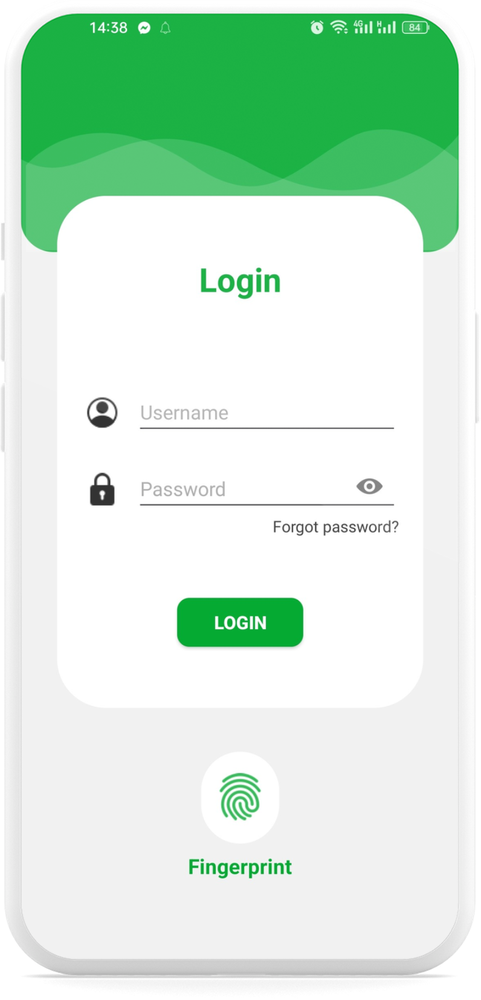
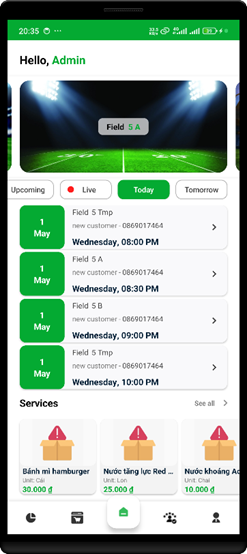
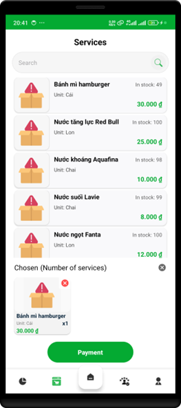
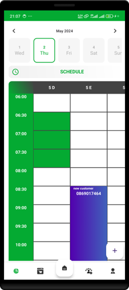
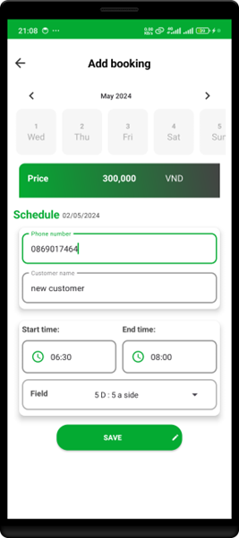
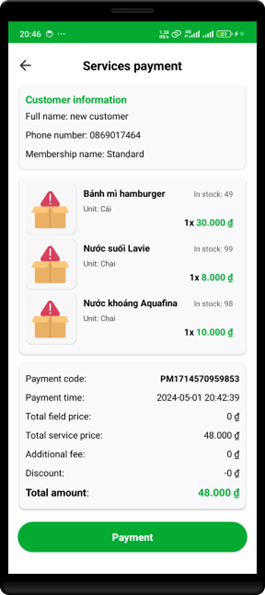

# Mini Soccer Field Management Android Application

## Introduction

The project aims to build an Android application to manage artificial turf fields efficiently.

## Project Details

- **Course**: Mobile Programming
- **Project Title**: Building an Android Application for Artificial Turf Field Management

### Team Members

- **Nguyễn Thanh Huy** - 21110473
- **Trần Lâm Nhựt Khang** - 21110497
- **Nguyễn Thiện Luân** - 21110538
- **Lê Quang Lâm** - 21110894

## Tools and Technologies

- **Database**: SQLite
- **UI Design**: Figma
- **Backend Language**: Java
- **Frontend Development**: Java & Android SDK Toolkit
- **IDE**: Android Studio
- **Version Control**: GitHub

## Installation and Setup
* Clone the repository
```bash
git clone https://github.com/chickenHuy/MiniSoccerFieldManagement-Android.git
```
* Open the project in Android Studio
* Run the application on an emulator or a physical device
* Login with the following credentials:
    - **Username**: admin
    - **Password**: admin

## Application overview

*Login Screen*

<div align="center">
    
</div>

*Home Screen*

<div align="center">
    
</div>

*Service Screen*

<div align="center">
    
</div>

*Booking Field Screen*

<div align="center">
    
    
</div>

*Payment Screen*

<div align="center">
    
</div>
